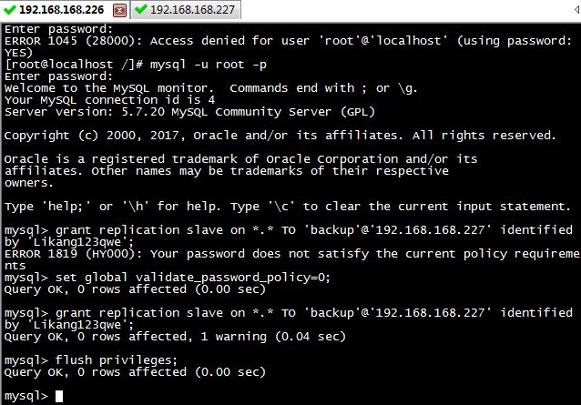
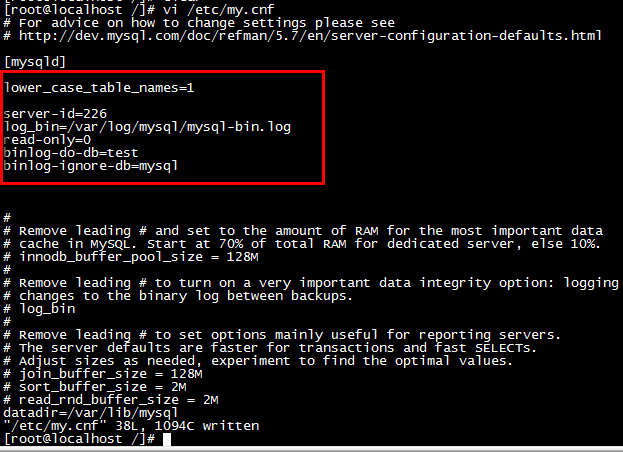
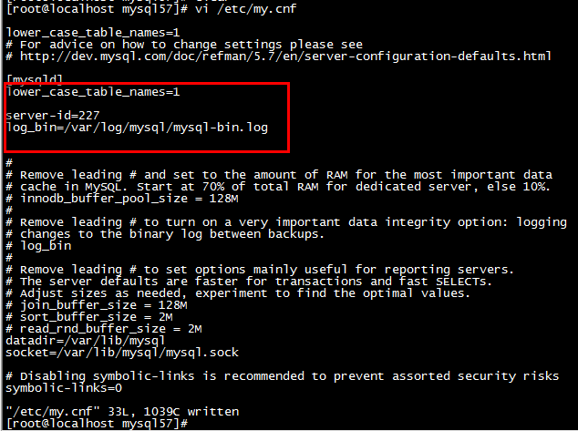
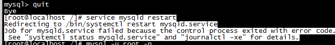
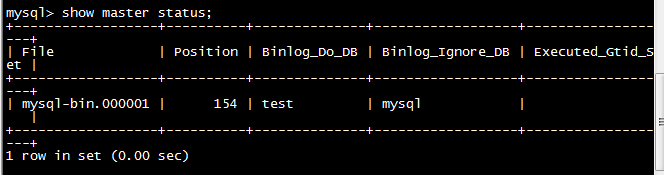
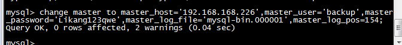

[TOC]

# Mysql主从配置

## 

## 配置信息

Mysql主服务器：

```
版本：mysql  Ver 14.14 Distrib 5.7.20
IP:192.168.168.226
PORT:3306
```

Mysql从服务器

```
版本：mysql  Ver 14.14 Distrib 5.7.20
IP:192.168.168.227
PORT:3306
```

服务器：

```
CentOS 7
```

## 搭建步骤

- 登录主服务器，执行如下命令：

  ```
  mysql -u root -p

  提示密码安全策略问题：
  set global validate_password_policy=0;

  grant replication slave on *.* TO 'backup'@'192.168.56.101' identified by 'uioqv...backup';
  flush privileges
  ```

  

- 编辑主服务器的数据库配置文件信息my.cnf

  ```
  vi /etc/my.cnf

  添加如下信息：
      server-id=226
      log_bin=/var/log/mysql/mysql-bin.log
      read-only=0
      binlog-do-db=test
      binlog-ignore-db=mysql
  ```

  

- 登录从服务器，执行如下命令：

  ```
  编辑从服务器的数据库配置文件信息：my.cnf

  vi /etc/my.cnf

  server-id=227
  log_bin=/var/log/mysql/mysql-bin.log
  ```

  

- 重启主服务器

  ```
  service mysqld restart

  提示如下信息：
  ```

  

  ```
  修改：

  进入/var/log/文件夹下，新建文件mysql，进入mysql目录，新建文件mysql-bin.log文件，并赋予读写权限(mysql和mysql-bin.log)
  ```

- 登录主服务器，查看master状态

  ```
  show master status\G;
  ```

  

- 登录从服务器，设置主从关系

  ```
  change master to master_host='192.168.168.226',master_user='backup',master_password='Likang123qwe',master_log_file='mysql-bin.000001',master_log_pos=154;
  ```

  

- 查看从服务器的主从关系状态

  ```
  show slave status\G;
  ```

- 主服务器下执行

  ```
  /sbin/iptables -I INPUT -p tcp --dport 3306 -j ACCEPT
  ```

- 从服务器下执行

  ```
  /sbin/iptables -I INPUT -p tcp --dport 3306 -j ACCEPT
  ```

- 如果主从库中不存在test库，则需要重新建库，然后重启，重新构建主从关系

- 从服务器下

  ```
   Slave_IO_Running: Yes
   Slave_SQL_Running: Yes
  ```

  如果都为yes，则主从搭建成功

## 问题1 数据库 uuid相同

出现这种问题是因为数据库是复制的

将服务器间uuid改变为不同即可

1. 生成uuid

   ```bash
   uuidgen 
   e79ce75f-e93a-484b-98ca-559dd79844e3
   ```


1. 找到auto.cnf文件

   ```bash
   find / -name auto.cnf 
   /var/lib/mysql/auto.cnf
   ```

2. 修改server-uuid

   ```bash
   [auto]
   server-uuid=e79ce75f-e93a-484b-98ca-559dd79844e3
   ```