[TOC]


# CentOS 7安装Mysql57数据库

## 

## 软件要求

虚拟机：VMware Workstation

系统版本：CentOS-7-x86_64(Linux)

Mysql版本：mysql57-community-release-el7-11.noarch.rpm

安装工具：SSH客户端

### 安装步骤

本教程，使用在线安装模式，请保持外网络畅通

- 使用root用户登录系统，并切换到根目录

- 进入opt文件下，创建文件目录mysql57，并进入

  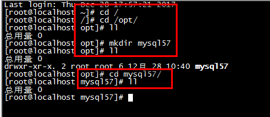

- 在/opt/mysql57/，目录下，输入命令,下载mysql的安装文件，使用rpm安装:

  ```
  wget http://repo.mysql.com/mysql57-community-release-el7-11.noarch.rpm
  ```

  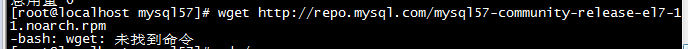

- 如果提示wget命令未找到，则在保持外网网络畅通下执行命令：

  ```
  cd /
  yum install wget -y
  ```

  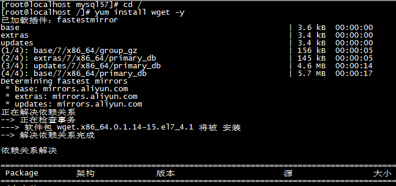

- 再次切换到/opt/mysql57目录下，执行下载命令：

  ```
  wget http://repo.mysql.com/mysql57-community-release-el7-11.noarch.rpm
  ```

  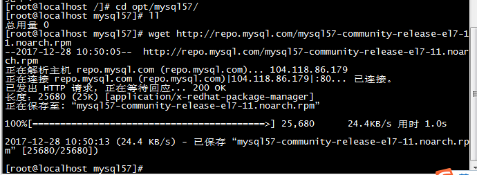

- 下载完毕之后，执行如下命令：

  ```
  sudo rpm -ivh mysql57-community-release-el7-11.noarch.rpm
  ```

  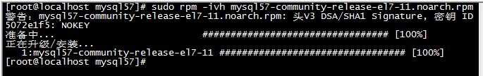

- 执行如下命令，安装mysql数据库

  ```
  sudo yum install mysql-server
  ```

- 安装过程中提示如下信息，输入y，然后回车即可

  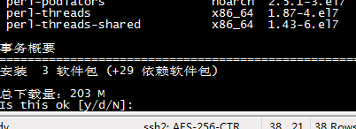 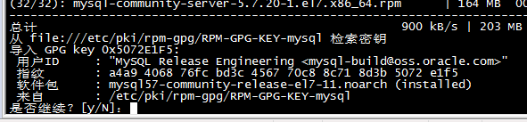

- 至此，mysql基本安装已经成功，接下来配置mysql一些相关信息

  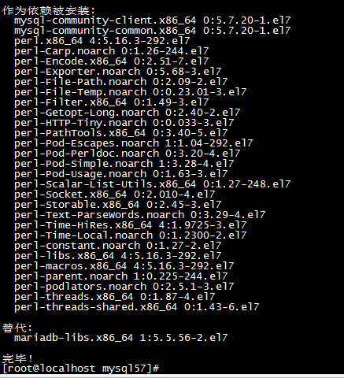

- 输入如下命令，登录数据库客户端

  ```
  mysql -u root
  ```

- 提示如下信息：

  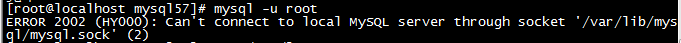

- 是因为此目录，没有对应的操作权限问题，执行如下命令修改目录权限

  ```
  sudo chown -R root:root /var/lib/mysql
  ```

- 重新启动数据库，执行如下命令：

  ```
  service mysqld restart
  ```

- 再次登录，执行如下命令：

  ```
  mysql -u root -p

  初始化密码查看：

  通过命令：more /var/log/mysqld.log   获取：1#;htwi(e>Bw
  ```

  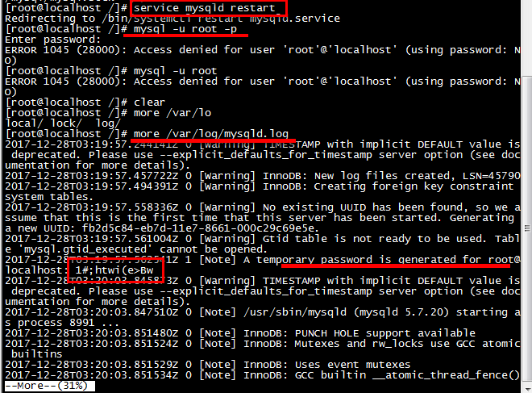

- 再次登录，执行如下命令：

  ```
  mysql -u root -p
  ```

  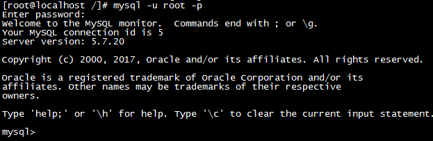

- 修改登录密码

  alter user user() identified by 'Likang123qwe';

- 提示密码安全问题

  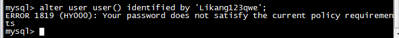

- 执行如下命令，修改密码安全策略后，再次修改密码

  ```
  set global validate_password_policy=0;
  ```

  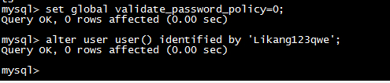

- 重启mysql数据库，测试密码登录

  ```
  service mysqld restart
  ```

  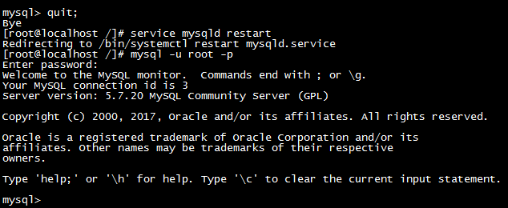

- 如果此时需要远程客户端访问数据库，则还需要进行如下配置

  - 开启3306默认端口，并保存

    ```
    /sbin/iptables -I INPUT -p tcp --dport 3306 -j ACCEPT
    ```

  - 设置远程连接信息

    ```
    mysql -u root -p

    use mysql;

    update user set host='%' where user ='root' and host='localhost';

    select host,user from user;

    set global validate_password_policy=0;

    grant all privileges on *.* to root@'%' identified by 'Likang123qwe' with grant option;
    ```

  - 重启mysql服务

    ```
    service mysqld restart
    ```

    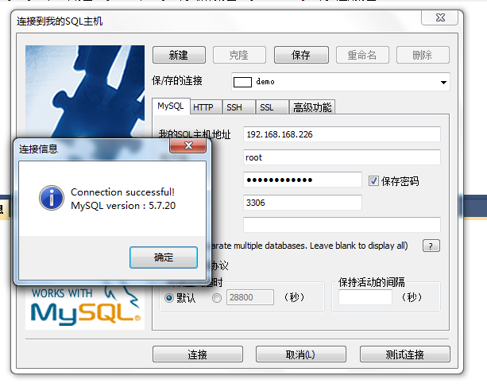

- 取消mysql默认分区表、字段的大小写

  ```
  修改配置文件/etc/my.conf
  lower_case_table_names=1  不区分大小写
  lower_case_table_names=0  默认、区分大小写
  ```