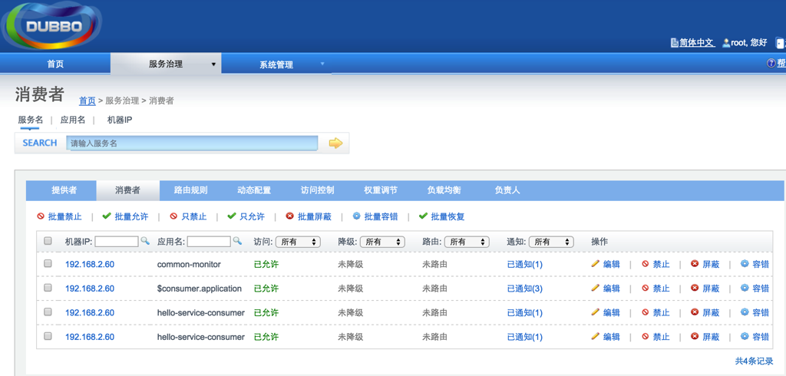
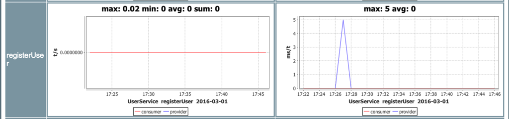

[TOC]

### 一、为啥整合 Dubbo 实现 SOA

Dubbo 不单单只是高性能的 RPC 调用框架，更是 SOA 服务治理的一种方案。

**核心**：

1. 远程通信，向本地调用一样调用远程方法。
2. 集群容错
3. 服务自动发现和注册，可平滑添加或者删除服务提供者。

​	我们常常使用 Springboot 暴露 HTTP 服务，并走 JSON 模式。但慢慢量大了，一种 SOA 的治理方案。这样可以暴露出 Dubbo 服务接口，提供给 Dubbo 消费者进行 RPC 调用。下面我们详解下如何集成 Dubbo。

### 二、Dubbo服务注册订阅流程

1. 启动服务提供者
2. 服务提供者在注册中心注册服务
3. 消费者向注册中心订阅服务
4. 注册中心通知消费者
5. 消费者根据注册中心信息调用服务
6. 监控平台监控消费者与服务提供者

### 三、Dubbo监控平台

> dubbo官方自带了dubbo-admin及dubbo-simple/dubbo-monitor-simple二个子项目用于服务治理及服务监控。 

一、dubbo-admin的部署

这个比较简单，编译打包成功后，将dubbo-admin/target/dubbo-admin-2.8.xxx.war 复制到jetty、tomcat下的webapps就算完成部署了(当然，也可以部署到其它兼容的servlet容器，比如jboss、weblogic)

然后浏览：http://localhost:8080/dubbo-admin/ 会提示登陆用户名、密码，这是在配置文件里写死的，配置文件的路径为：

dubbo-admin/src/main/webapp/WEB-INF/dubbo.properties

即用户名、密码均为root，登录成功后，刷新下页面，如果提示404之类的，退回到http://localhost:8080/浏览（这个跟部署的contextPath有关，如果contextPath设置为/dubbo-admin，刷新下就可以了，如果contextPath设置成/，则登录后要退回/浏览）

dubbo的服务治理是其特色之一，管理界面如下：

 

二、dubbo-monitor-simple 部署

打包后，目录dubbo-simple/dubbo-monitor-simple/target中会生成dubbo-monitor-simple-xxx-assembly.tar.gz，用tar -zxvf *.gz 解压，解压后有三个子目录bin、conf、lib ，conf里面是配置文件：

参考上面改，然后bin下有一个start.sh脚本，启动即可，访问后浏览http://localhost:8180 (端口号要跟配置里一致)

这是调用次数的统计　　

这是图表统计

这是服务之间的依赖关系

注：官网的监控是把所有监控数据（主要是统计数据和表图数据）保存到服务器磁盘上的，运行时间久了，硬盘可能会撑满，要注意及时清理(就是配置文件里面配置的3个目录下)。监控数据也并非实时统计的，所以第1次部署成功后马上去看统计数据，可能没有，随便跑一个service provider/service consumer的用例，然后等一会儿就行了。