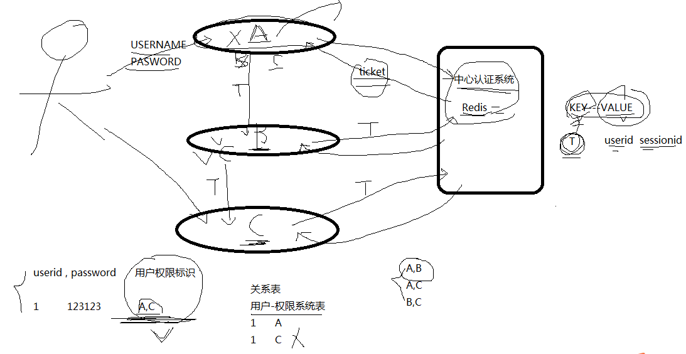

SSO原理：

```
SSO：全称单点登陆

目的：解决用户多次，频繁登陆的问题

前提：这些登陆的系统之间，都是相互信任的

应用场景：

        1：门户网站、系统：portal
        2：分布式dubbo

        3：集群(数据库)
```



## 架构之路 | 浅谈单点登录（SSO）技术实现机制

Original *2017-09-19* *康哥* [码神联盟](https://mp.weixin.qq.com/s?__biz=MzIxMjg4NDU1NA==&mid=2247484038&idx=1&sn=32cca5c6cff33372cba0a6829a6be530&chksm=97be0fa3a0c986b594fe69776f56fd86afd72859e6b2797e2583df4cb482b73ab767551d2590&scene=21##)


## 1何为单点登录?

单点登录（Single Sign On），简称为 SSO，是目前比较流行的企业业务整合的解决方案之一。SSO的定义是在多个应用系统中，用户只需要登录一次就可以访问所有相互信任的应用系统。

## ２用来解决什么问题?

解决了用户只需要登录一次就可以访问所有相互信任的应用系统，而不用重复登录。

## 3常见的实现方式

单点登录有不同的实现方式，本文就罗列我开发中所遇见过的实现方式。

**以Cookie作为凭证媒介：**

最简单的单点登录实现方式，是使用cookie作为媒介，存放用户凭证。

用户登录父应用之后，应用返回一个加密的cookie，当用户访问子应用的时候，携带上这个cookie，授权应用解密cookie并进行校验，校验通过则登录当前用户。

以上方式把信任存储在客户端的Cookie中，这种方式很容易令人质疑：

- Cookie不安全

- 不能跨域实现免登

  ​

对于第一个问题，通过加密Cookie可以保证安全性，当然这是在源代码不泄露的前提下。如果Cookie的加密算法泄露，攻击者通过伪造Cookie则可以伪造特定用户身份，这是很危险的。

对于第二个问题，更是硬伤。

## **通过JSONP实现：**

对于跨域问题，可以使用JSONP实现。
用户在父应用中登录后，跟Session匹配的Cookie会存到客户端中，当用户需要登录子应用的时候，授权应用访问父应用提供的JSONP接口，并在请求中带上父应用域名下的Cookie，父应用接收到请求，验证用户的登录状态，返回加密的信息，子应用通过解析返回来的加密信息来验证用户，如果通过验证则登录用户。

这种方式虽然能解决跨域问题，但是安全性其实跟把信任存储到Cookie是差不多的。如果一旦加密算法泄露了，攻击者可以在本地建立一个实现了登录接口的假冒父应用，通过绑定Host来把子应用发起的请求指向本地的假冒父应用，并作出回应。

因为攻击者完全可以按照加密算法来伪造响应请求，子应用接收到这个响应之后一样可以通过验证，并且登录特定用户。

**通过页面重定向的方式：**

最后一种介绍的方式，是通过父应用和子应用来回重定向中进行通信，实现信息的安全传递。

父应用提供一个GET方式的登录接口，用户通过子应用重定向连接的方式访问这个接口，如果用户还没有登录，则返回一个的登录页面，用户输入账号密码进行登录。如果用户已经登录了，则生成加密的Token，并且重定向到子应用提供的验证Token的接口，通过解密和校验之后，子应用登录当前用户

 这种方式较前面两种方式，接解决了上面两种方法暴露出来的安全性问题和跨域的问题，但是并没有前面两种方式方便。

安全与方便，本来就是一对矛盾。

**使用独立登录系统：**

一般说来，大型应用会把授权的逻辑与用户信息的相关逻辑独立成一个应用，称为用户中心。

用户中心不处理业务逻辑，只是处理用户信息的管理以及授权给第三方应用。第三方应用需要登录的时候，则把用户的登录请求转发给用户中心进行处理，用户处理完毕返回凭证，第三方应用验证凭证，通过后就登录用户。

以下讲解下以使用独立登录系统的实现机制：

## 4单点登录的技术实现机制

先看下图：


当用户第一次访问应用系统1的时候，因为还没有登录，会被引导到认证系统中进行登录；根据用户提供的登录信息，认证系统进行身份效验，如果通过效验，应该返回给用户一个认证的凭据－ticket；用户再访问别的应用的时候，就会将这个ticket带上，作为自己认证的凭据，应用系统接受到请求之后会把ticket送到认证系统进行效验，检查ticket的合法性（4,6）。如果通过效验，用户就可以在不用再次登录的情况下访问应用系统2和应用系统3了。

从上图可以看出sso的实现技术点：

**1）所有应用系统共享一个身份认证系统**

统一的认证系统是SSO的前提之一。认证系统的主要功能是将用户的登录信息和用户信息库相比较，对用户进行登录认证；认证成功后，认证系统应该生成统一的认证标志（ticket），返还给用户。另外，认证系统还应该对ticket进行效验，判断其有效性。

**2）所有应用系统能够识别和提取ticket信息**

　要实现SSO的功能，让用户只登录一次，就必须让应用系统能够识别已经登录过的用户。应用系统应该能对ticket进行识别和提取，通过与认证系统的通讯，能自动判断当前用户是否登录过，从而完成单点登录的功能。

关于统一身份认证机制：如下图

****

①用户请求访问业务系统。

②业务系统在系统中查看是否有对应请求的有效令牌，若有，则读取对应的身份信息，允许其访问；若没有或令牌无效，则把用户重定向到统一身份认证平台，并携带业务系统地址，进入第③步。

③在统一身份认证平台提供的页面中，用户输入身份凭证信息，平台验证此身份凭证信息，若有效，则生成一个有效的令牌给用户，进入第④步；若无效，则继续进行认证，直到认证成功或退出为止。

④用户携带第③步获取的令牌，再次访问业务系统。

⑤业务系统获取用户携带的令牌，提交到认证平台进行有效性检查和身份信息获取。

⑥若令牌通过有效性检查，则认证平台会把令牌对应的用户身份信息返回给业务系统，业务系统把身份信息和有效令牌写入会话状态中，允许用户以此身份信息进行业务系统的各种操作；若令牌未通过有效性检查，则会再次重定向到认证平台，返回第③步。

通过统一身份认证平台获取的有效令牌，可以在各个业务系统之间实现应用漫游。

## 5单点登录的优、缺点

**优点：**

1）提高用户的效率。

　　用户不再被多次登录困扰，也不需要记住多个 ID 和密码。另外，用户忘记密码并求助于支持人员的情况也会减少。 

2）提高开发人员的效率。

　　SSO 为开发人员提供了一个通用的身份验证框架。实际上，如果 SSO 机制是独立的，那么开发人员就完全不需要为身份验证操心。他们可以假设，只要对应用程序的请求附带一个用户名，身份验证就已经完成了。 

3）简化管理。

　　如果应用程序加入了单点登录协议，管理用户帐号的负担就会减轻。简化的程度取决于应用程序，因为 SSO 只处理身份验证。所以，应用程序可能仍然需要设置用户的属性（比如访问特权）。

**缺点：**

1）不利于重构

　　因为涉及到的系统很多，要重构必须要兼容所有的系统，可能很耗时

2） 无人看守桌面

　　因为只需要登录一次，所有的授权的应用系统都可以访问，可能导致一些很重要的信息泄露。