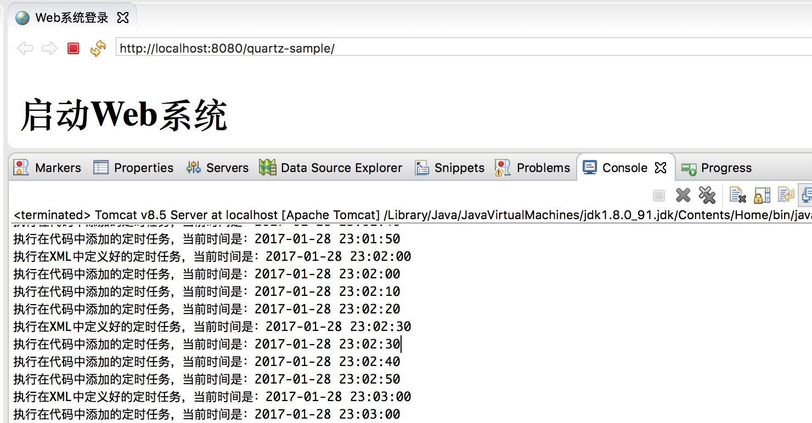
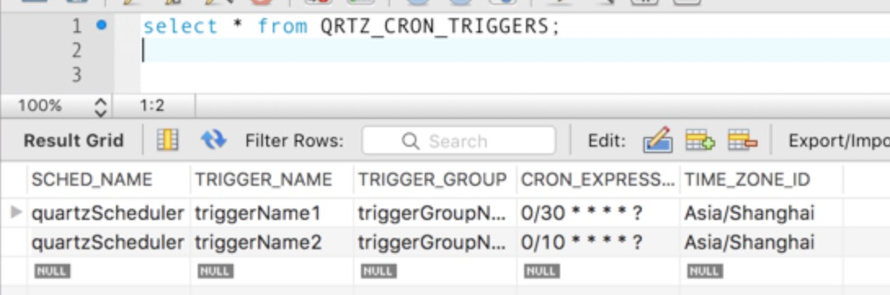

[TOC]

# Spring Quartz 实现原理与示例

JAVA 针对定时任务，有 Timer，Scheduler, Quartz 等几种实现方式，其中最常用的应该就是 Quartz 了。

本文旨在简要介绍 Quartz 的基本概念，在xml中添加定时器，以及使用JAVA代码动态地修改定时器配置。并附带了源代码，可以下载并运行。

## 1. Quartz的基本概念

在开始之前，我们必须了解以下的几个基本概念：Job、Trigger、Cron expression、JobStores

### 1.1. Job

对于任务内容的构建，我们需要创建 Job 的继承类，并实现 execute 方法。

### 1.2. Trigger

其作用是设置调度策略。Quartz 设计了多种类型的 Trigger，其中最常用的是 SimpleTrigger 和 CronTrigger。
SimpleTrigger 适用于在某一特定的时间以某一特定时间间隔执行多次。

CronTrigger 的用途更广，主要适用于基于日历的调度安排。例如：每星期二的 16:38:10 执行，每月一号执行，等等。本文使用的是CronTrigger。

### 1.3. Cron表达式

由七个字段组成：

[](javascript:void(0);)

```
Seconds
Minutes
Hours
Day-of-Month
Month
Day-of-Week
Year (Optional field)
```

[](javascript:void(0);)

举例如下：

创建一个每三小时执行的 CronTrigger，且从每小时的整点开始执行：

```
0 0 0/3 * * ?
```

这里不打算对 Cron 表达式作过多的阐述，更多的内容请查看Oracle官方文档：

<http://docs.oracle.com/cd/E12058_01/doc/doc.1014/e12030/cron_expressions.htm>

对于初学者，推荐使用在线的Cron生成器：
[http://cron.qqe2.com](http://cron.qqe2.com/)

### 1.4. JobStores

负责对Quartz的持久化，即将任务调度的相关数据保存在数据库中。这样，在系统重启后，任务的调度状态依然存在系统中。当任务错过了触发时间时，还可以重新触发并执行（需要配置）。

好了，基础概念介绍完了以后，我们开始搭建一个工程来完成定时任务吧。

 

## 2. 新建 Quartz 工程

我们会新建一个 Maven 工程，并在启动Web应用之后运行定时任务。

### 2.1. 新建工程

在 Eclipse 中，新建 Maven 项目并引入 Jar 包

工程的相关细节，大家请直接参考源码。

### 2.2. 版本信息

| Java   | 1.8           |
| ------ | ------------- |
| Tomcat | 8.5           |
| Spring | 4.3.3.RELEASE |
| Quartz | 2.2.1         |

 

 

 

 

### 2.3. 工程结构


### 2.4. Spring Quartz 的配置

主要是定义了数据源，调度工厂以及定时任务的配置：

[](javascript:void(0);)

```xml
<?xml version="1.0" encoding="UTF-8"?>
<beans xmlns="http://www.springframework.org/schema/beans"
    xmlns:xsi="http://www.w3.org/2001/XMLSchema-instance"
    xmlns:context="http://www.springframework.org/schema/context"
    xsi:schemaLocation="http://www.springframework.org/schema/beans 
            http://www.springframework.org/schema/beans/spring-beans-4.3.xsd
            http://www.springframework.org/schema/context
            http://www.springframework.org/schema/context/spring-context-4.3.xsd"
            default-autowire="no" >
    
    <!-- 读取属性文件 -->
    <context:property-placeholder location="classpath*:properties/quartz.properties" 
        ignore-unresolvable="true" />
    
    <!-- 扫描包 -->
    <context:component-scan base-package="org.stevexie" />
    
    <!-- 数据源 -->
    <bean id="quartzDataSource" class="org.springframework.jdbc.datasource.DriverManagerDataSource">
        <property name="driverClassName">
            <value>${jdbc.driverclass}</value>
        </property>
        <property name="url">
            <value>${jdbc.url}</value>
        </property>
        <property name="username">
            <value>${jdbc.username}</value>
        </property>
        <property name="password">
            <value>${jdbc.password}</value>
        </property>
    </bean>
    
    <!-- ======================== 调度工厂开始 ======================== -->
    <bean id="quartzScheduler" class="org.springframework.scheduling.quartz.SchedulerFactoryBean" lazy-init="false" autowire="no">
        <!-- 设置持久化的数据源 -->
        <property name="dataSource">
            <ref bean="quartzDataSource" />
        </property>
        
        <!-- 设置Quartz的属性 -->
        <property name="quartzProperties">
            <props>
                <!-- 线程池配置 -->
                <prop key="org.quartz.threadPool.class">org.quartz.simpl.SimpleThreadPool</prop>
                <!-- 初始化线程数为20 -->
                <prop key="org.quartz.threadPool.threadCount">20</prop>
                <!-- 设置作业的优先级是5 -->
                <prop key="org.quartz.threadPool.threadPriority">5</prop>
                <!-- 初始化线程数为20 -->
                <prop key="org.quartz.jobStore.misfireThreshold">60000</prop>
                
                <!-- JobStore 配置，通过数据库存储最终调度程序的配置 -->
                <prop key="org.quartz.jobStore.class">org.quartz.impl.jdbcjobstore.JobStoreTX</prop>
                <prop key="org.quartz.jobStore.driverDelegateClass">org.quartz.impl.jdbcjobstore.StdJDBCDelegate</prop>
                
                <!-- 数据表名的前缀设置 -->
                <prop key="org.quartz.jobStore.tablePrefix">QRTZ_</prop>
            </props>
        </property>
        
        <!-- 设置应用初始化之后，延迟30秒再启动scheduler -->
        <property name="startupDelay" value="30" />
        
        <property name="applicationContextSchedulerContextKey" value="applicationContext" />
        
        <!-- 设置定时任务随web启动 -->
        <property name="autoStartup" value="true" />
        
        <property name="triggers">
            <list>
                <ref bean="definedInXMLcronTrigger"/>
            </list>
        </property>
    </bean>
    <!-- ======================== 调度工厂结束 ======================== -->
    
    <!-- ======================== 定时任务1 开始 ======================== -->
    <bean id="definedInXMLJobDetail" class="org.springframework.scheduling.quartz.JobDetailFactoryBean">
        <!-- 必填项：在此处定义job detail -->
        <property name="jobClass" value="org.stevexie.jobdetail.DefinedInXMLJobDetail" />
        <!-- 必填项：在此处定义job name -->
        <property name="name" value="jobName1"></property>
        <!-- 必填项：在此处定义job group name -->
        <property name="group" value="jobGroupName1"></property>
        <!-- 选填项：设置该job是持久性的 -->
        <property name="durability" value="true" />
        <!-- 选填项：设置该job是中断后可恢复的 -->
        <property name="requestsRecovery" value="true" />
    </bean>
    
    <bean id="definedInXMLcronTrigger"
        class="org.springframework.scheduling.quartz.CronTriggerFactoryBean">
        <!-- 必填项：在此处定义trigger name -->
        <property name="name" value="triggerName1" />
        <!-- 必填项：在此处定义trigger group name -->
        <property name="group" value="triggerGroupName1" />
        <property name="jobDetail" ref="definedInXMLJobDetail" />
        <!-- 必填项：在此处定义定时任务时间 -->
        <property name="cronExpression" value="0/10 * * * * ? " />
        <!-- 选填项：在此处定义市区 -->
        <property name="timeZone" ref="timeZone" />
        <property name="misfireInstruction" value="1" />
    </bean>
    <!-- ======================== 定时任务1 结束 ======================== -->
    
    <!-- 时区 -->
    <bean id="timeZone" class="java.util.TimeZone" factory-method="getTimeZone">
        <constructor-arg value="GMT+08:00" />
    </bean>
</beans>
```

[](javascript:void(0);)

### 2.5. 定时任务

实现两个定时任务：一个是在应用初始化的时候启动；另一个是通过运行代码中的main方法来实现对定时任务的增删改。

#### 2.5.1. 定时任务1

随着应用的启动而实例化，每10秒打印一条语句：

[](javascript:void(0);)

```java
package org.stevexie.jobdetail; 
 
import org.quartz.JobExecutionContext; 
import org.springframework.scheduling.quartz.QuartzJobBean; 
import org.stevexie.util.DateUtil; 
 
public class DefinedInXMLJobDetail extends QuartzJobBean { 
     
    @Override 
    protected void executeInternal(JobExecutionContext context) { 
        System.out.println("执行在XML中定义好的定时任务，当前时间是：" +  
                                        DateUtil.currentDatetime()); 
    } 
}
```

[](javascript:void(0);)

#### 2.5.2. 定时任务2

与定时任务1的内容基本一致，但主要是在 JAVA 代码中被实例化并实现定时任务的增删改。

[](javascript:void(0);)

```java
package org.stevexie.jobdetail;

import org.quartz.JobExecutionContext;
import org.springframework.scheduling.quartz.QuartzJobBean;
import org.stevexie.util.DateUtil;

public class DefinedInCodeJobDetail extends QuartzJobBean {
       
    @Override
    protected void executeInternal(JobExecutionContext context) {
        System.out.println("执行在代码中添加的定时任务，当前时间是：" +  
                                    DateUtil.currentDatetime());
    }  
}
```

### 2.6. 定时任务的增删改工具类

```java
package org.stevexie.util;

import java.text.ParseException;

import javax.annotation.Resource;

import org.apache.commons.lang.StringUtils;
import org.quartz.CronScheduleBuilder;
import org.quartz.CronTrigger;
import org.quartz.Job;
import org.quartz.JobBuilder;
import org.quartz.JobDetail;
import org.quartz.JobKey;
import org.quartz.Scheduler;
import org.quartz.SchedulerException;
import org.quartz.Trigger;
import org.quartz.TriggerBuilder;
import org.quartz.TriggerKey;
import org.springframework.context.ApplicationContext;
import org.springframework.context.support.ClassPathXmlApplicationContext;
import org.springframework.stereotype.Component;
import org.stevexie.jobdetail.DefinedInCodeJobDetail;
import org.stevexie.jobdetail.DefinedInXMLJobDetail;

@Component("quartzUtil")
public class QuartzUtil {
    
    @Resource(name="quartzScheduler")
    private Scheduler scheduler;
    
    private static String JOB_GROUP_NAME = "ddlib";
    private static String TRIGGER_GROUP_NAME = "ddlibTrigger";
    
    /**
     * 添加一个定时任务，使用默认的任务组名，触发器名，触发器组名
     * @param job Job任务类实例
     * @param jobName job名字(请保证唯一性)
     * @param cronExpression cron时间表达式
     * @throws SchedulerException 
     */
    public void addJob(String jobName, Job job, String cronExpression)
            throws SchedulerException, ParseException{
        addJob(job, jobName, null, jobName, null, cronExpression, 5);
    }
    
    /**
     * 开始一个simpleSchedule()调度(创建一个新的定时任务)
     * @param job Job任务类实例
     * @param jobName  job名字(请保证唯一性)
     * @param jobGroupName  job组名(请保证唯一性)
     * @param cronExpression    cron时间表达式
     * @param triggerName   trigger名字(请保证唯一性)
     * @param triggerGroupName  triggerjob组名(请保证唯一性)
     * @throws SchedulerException 
     */
    public void addJob(Job job, String jobName, String jobGroupName, 
                                String triggerName, String triggerGroupName, 
                                String cronExpression, int triggerPriority) 
                                                throws SchedulerException {
        
        if(StringUtils.isEmpty(jobGroupName)){
            jobGroupName = JOB_GROUP_NAME;
        }
        if(StringUtils.isEmpty(triggerGroupName)){
            triggerGroupName = TRIGGER_GROUP_NAME;
        }
        
        // 1、创建一个JobDetail实例，指定Quartz
        JobDetail jobDetail = JobBuilder.newJob(job.getClass())
                // 任务执行类
                .withIdentity(jobName, jobGroupName)
                // 任务名，任务组
                .build();
        
        // 2、创建Trigger
        // 优先级默认是5，数字越高优先级越高
        Trigger trigger = TriggerBuilder.newTrigger()
                .withIdentity(triggerName, triggerGroupName).startNow()
                .withSchedule(CronScheduleBuilder.cronSchedule(cronExpression))
                .withPriority(triggerPriority)
                .build();
        
        // 3、移除job，避免因为job的重复添加导致错误
        this.removeJob(jobName, jobGroupName, triggerName, triggerGroupName);
        
        // 4、调度执行
        try {
            scheduler.scheduleJob(jobDetail, trigger);
        } catch (SchedulerException e) {
            e.printStackTrace();
            throw e;
        }
        
        // 4、启动  
        this.startSchedule();
    }
    
    /**
     * 开始任务
     * @throws SchedulerException 
     */
    public void startSchedule() throws SchedulerException {
        try {
            if(scheduler.isShutdown()){
                scheduler.resumeAll();
            } else {
                scheduler.start();
            }
        } catch (SchedulerException e) {
            e.printStackTrace();
            throw e;
        }
    }
    
    /**
     * 暂停Job
     * @param name job名字
     * @param group  job组名
     * @throws SchedulerException 
     */
    public void pauseJob(String jobName, String jobGroupName) 
                                    throws SchedulerException {
        JobKey jobKey = JobKey.jobKey(jobName, jobGroupName);
        try {
            scheduler.pauseJob(jobKey);
        } catch (SchedulerException e) {
            e.printStackTrace();
            throw e;
        }
    }
    
    /**
     * 恢复Job
     * @param name  job名字
     * @param group  job组名
     * @throws SchedulerException 
     */
    public void resumeJob(String jobName, String jobGroupName) 
                                    throws SchedulerException {
        JobKey jobKey = JobKey.jobKey(jobName, jobGroupName);
        try {
            scheduler.resumeJob(jobKey);
        } catch (SchedulerException e) {
            e.printStackTrace();
            throw e;
        }
    }
    
    /**  
     * 修改一个任务的触发时间(使用默认的任务组名，触发器名，触发器组名) 
     */  
    public void modifyJobTime(String jobName, String cronExpression)
            throws SchedulerException, ParseException {
        rescheduleJob(jobName, null, cronExpression);
    }
    
    /**
     * 更新任务表达式
     * @param triggerName  trigger名字
     * @param triggerGroupName  trigger组名
     * @param newCronExpression  cron时间表达式
     * @throws SchedulerException 
     */
    public void rescheduleJob(    String triggerName, 
                                String triggerGroupName, 
                                String newCronExpression) 
                                throws SchedulerException {
        
        if(StringUtils.isBlank(triggerGroupName)) {
            triggerGroupName = TRIGGER_GROUP_NAME;
        }
        
        TriggerKey triggerKey = TriggerKey.triggerKey(triggerName, triggerGroupName);
        
        // 获取trigger
        CronTrigger trigger = (CronTrigger) scheduler.getTrigger(triggerKey);
        
        // 按新的cronExpression表达式重新构建trigger
        trigger = trigger
                .getTriggerBuilder()
                .withIdentity(triggerKey)
                .withSchedule(CronScheduleBuilder.cronSchedule(newCronExpression))
                .build();
        
        // 按新的trigger重新设置job执行
        try {
            scheduler.rescheduleJob(triggerKey, trigger);
        } catch (SchedulerException e) {
            e.printStackTrace();
            throw e;
        }
    }
    
    /** 移除一个任务和触发器(使用默认的任务组名，触发器名，触发器组名) */
    public void removeJob(String jobName,String triggerName)
            throws SchedulerException{
        removeJob(jobName, null, triggerName, null);
    }
    
    /** 移除一个任务和触发器  */
    public void removeJob(String jobName, String jobGroupName, 
            String triggerName, String triggerGroupName)
                    throws SchedulerException {
        
        if(StringUtils.isEmpty(jobGroupName)) {
            jobGroupName = JOB_GROUP_NAME;
        }
        if(StringUtils.isEmpty(triggerGroupName)) {
            triggerGroupName = TRIGGER_GROUP_NAME;
        }
        
        JobKey jobKey = JobKey.jobKey(jobName, jobGroupName);
        TriggerKey triggerKey = TriggerKey.triggerKey(triggerName, triggerGroupName);
        
        scheduler.pauseTrigger(triggerKey);            // 停止触发器
        scheduler.unscheduleJob(triggerKey);        // 移除触发器
        scheduler.deleteJob(jobKey);                // 删除任务
    }
    
    public static void main(String[] args) {
        ApplicationContext context = null;
        context = new ClassPathXmlApplicationContext("classpath:spring/spring-quartz.xml");
        
        QuartzUtil quartzUtil = (QuartzUtil) context.getBean("quartzUtil");
        
        // 删除定时器
        try {
            quartzUtil.removeJob(   "jobName", 
                                    "jobGroupName", 
                                    "triggerName", 
                                    "triggerGroupName");
            quartzUtil.removeJob(   "jobName1", 
                                    "jobGroupName", 
                                    "triggerName", 
                                    "triggerGroupName");
            quartzUtil.removeJob(   "jobName2", 
                                    "jobGroupName", 
                                    "triggerName", 
                                    "triggerGroupName");
        } catch (SchedulerException e1) {
            e1.printStackTrace();
        }
        
        // 添加定时器
        try {
            quartzUtil.addJob(new DefinedInXMLJobDetail(), 
                    "jobName1", "jobGroupName1", 
                    "triggerName1", "triggerGroupName1", 
                    "0/20 * * * * ? ", 5);
            
            quartzUtil.addJob(new DefinedInCodeJobDetail(), 
                    "jobName2", "jobGroupName2", 
                    "triggerName2", "triggerGroupName2", 
                    "0/10 * * * * ? ", 5);
            
        } catch (SchedulerException e2) {
            e2.printStackTrace();
        }
        
        // 修改定时器
        try {
            quartzUtil.rescheduleJob(   "triggerName1", 
                                        "triggerGroupName1", 
                                        "0/30 * * * * ? ");
        } catch (SchedulerException e1) {
            e1.printStackTrace();
        }
        
        try {
            Thread.sleep(100*1000);
        } catch (InterruptedException e) {
            e.printStackTrace();
        }
    }
}
```

### 2.7. Quartz的执行脚本

需要在数据库中建一些Quartz的表。Quartz 的 distribution 包已提供了建表语句，放在\docs\dbTables目录中。下载地址是：

<http://www.quartz-scheduler.org/downloads/>

本文附带的源码中也包含了定时器的 SQL 执行脚本。

 3. 运行效果

### 3.1. 初次运行web项目

每十秒钟会执行一次定时任务。该任务是在XML中被定义的，随着Web应用的启动而实例化。


### 3.2. 修改定时任务的属性

停止 Web 项目，运行 QuartzUtil.java。结果显示，目前有两个定时任务正在运行：

​    - 定时任务一，每隔30秒运行一次，并打印：执行在XML中定义好的定时任务...

​    - 定时任务二，每隔10秒运行一次，并打印：执行在代码中添加的定时任务...


### 3.3. 再次运行 Web 项目，确认修改结果

执行结果与 3.2 一致，说明定时任务的触发时间已经成功被修改了：



 

### 3.4. 在数据库中，查询定时器信息，确认该调度程序已被成功地持久化。

