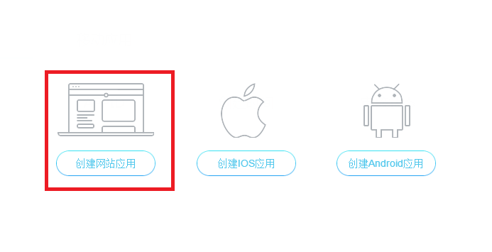

[TOC]

## 第三方登录（QQ\微信）

业务逻辑：

```
1：点击QQ图标，进入到授权页面
2：扫描二维码或者输入QQ号码密码，授权，点击登录
3：如果是第一次使用第三方登录，则一般跳转到绑定手机号页面
4：则登录成功，登录后的用户名昵称，则是QQ名称

5：如果是第二次登录，并进行授权，则是可以直接登录成功的
```

数据库设计：

```
1：在user表，增加两个字段，一个字段为QQ号，一个为openID
    用户名、昵称、密码、手机号、邮箱、QQ\weixin\openID
2：验证当前用户信息是否绑定QQ信息
```

代码开发步骤：

```
http://wiki.connect.qq.com/__trashed-2

https://connect.qq.com/index.html
```

平台要求：

```
1：登录QQ互联开发者平台，注册对应的用户信息（公司）
2：去http://wiki.connect.qq.com/sdk%E4%B8%8B%E8%BD%BD 下载对应的开发jar包和帮助文档
3：将依赖jar包和配置属性文件导入到本地工程
4：只需要修改属性文件的前3-4行
5：添加前置接口和回调函数
```

网站接入：

1：创建应用


选择需要创建的应用类型，我们以网站应用为例



点击创建网站应用后，按要求完善信息


网站信息填写完成，点击“创建应用”后，网站应用创建完成，点击“应用管理”，进入管理中心，在管理中心可以查看到网站获取的appid和appkey，如下图所示：


备注：创建移动应用与网站应用步骤方法一致，在此不赘述。

2：点击“应用中心”，应用右侧的“查看”，进入应用详情页面。


应用详情页面可点击“修改”来编辑应用“基本信息”和“平台信息”。


点击“应用接口”可查看已获取的接口，使用QQ登录功能。

